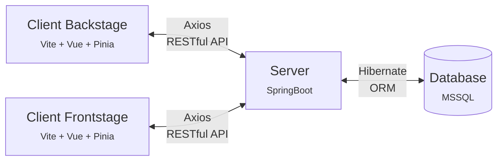

<div align="center">
  <h1 align="center">Fithub (The Frontend Part of Backstage)</h1>
</div>

<!-- TABLE OF CONTENTS -->

## Table of Contents

- [About Fithub](#About-Fithub)
- [Getting Started](#Getting-Started)
- [Usage](#Usage)
- [Acknowledgments](#Acknowledgments)
- [Contact](#Contact)

## About Fithub

- Read in other languages: [中文](README.chinese.md)

&emsp;Fithub is a dedicated fitness center committed to promoting a healthy lifestyle. Our aim is to encourage individuals to establish a consistent exercise routine, break out of comfort zones, and achieve physical and mental well-being to confront various challenges with confidence. As your fitness journey companion, Fithub offers diverse training programs and venue rental services, allowing you to relish the joy of exercise under professional guidance and seamlessly integrate it into your daily life.

&emsp;Whether you're a novice or an experienced fitness enthusiast, we are devoted to providing you with tailored training programs, ensuring lasting achievements on your path to health. Anchored by premium facilities and the support of passionate trainers, Fithub looks forward to partnering with you in crafting a healthy, vibrant lifestyle.

### Built With

- Database
  - SQL Server 2019 / 2022 (Database)
    <br/><br/>
- Backend
  - SpringBoot v3.1.2 (Framework)
  - Jpa / Hibernate (ORM)
    <br/><br/>
- Frontend
  - Vite v.4.4.6 (Project Built Tool)
  - Vue v.3.3.4 (Framework)
  - pinia v.2.1.6 (Store library)
  - pinia-plugin-persistedstate v3.2.0
  - Axios v1.5.0
  - naive-ui v2.34.4
  - Bootstrap v5.2.3
    <br/><br/>

* This repository is the frontend part of backstage in the Fithub project. Below are the links to the other parts of the Fithub project:

  - [Fithub-backend](https://github.com/ChrislaFolia/Fithub-backend)
  - [Fithub-frontend-frontstage](https://github.com/ChrislaFolia/Fithub-frontend-frontstage)

* The frontend-backend-database structure of the Fithub project is as follow:



<!-- GETTING STARTED -->

## Getting Started

### Recommended IDE Setup

[VSCode](https://code.visualstudio.com/) + [Volar](https://marketplace.visualstudio.com/items?itemName=Vue.volar) (and disable Vetur).

### Prerequisites

- Node.js

### Project Setup

1. Establish a Vite project
   ```sh
   npm create vite@latest
   ```
1. Clone the repo and move it to Vite project repository
   ```sh
   git clone https://github.com/ChrislaFolia/Fithub-frontend-backstage.git
   ```
1. Installation of dependencies
   ```sh
   npm install
   ```

### Working on the project

- Move into the project directory
- Run the development task:

  - Starts a server running at http://localhost:5174

    ```sh
     npm run dev
    ```

## Usage

- Membership System
- Course System
- Rental System
- Coupon System

## Acknowledgments

&emsp;We would like to demonstrate our gratitude to the following developers for their contributions to the following functionalities on the Fithub project:

- Membership System (Developed by QingJun)
- Course System (Developed by Chris Xiao)
- Rental System (Developed by William)
- Coupon System (Developed by Archer Lee)

&emsp;Your dedication and expertise in bringing these essential features the final iSpan course project. Thank you for your outstanding work throughout the development of the Fithub project!

## Contact

- Chris Xiao - [linkedin](https://www.linkedin.com/in/you-ren-hsiao-520997158/)

- Fithub Project Link
  - Backend : [https://github.com/ChrislaFolia/Fithub-backend](https://github.com/ChrislaFolia/Fithub-backend)
  - Frontend-frontstage : [https://github.com/ChrislaFolia/Fithub-frontend-frontstage](https://github.com/ChrislaFolia/Fithub-frontend-frontstage)
  - Frontend-backstage : [https://github.com/ChrislaFolia/Fithub-frontend-backstage](https://github.com/ChrislaFolia/Fithub-frontend-backstage)
